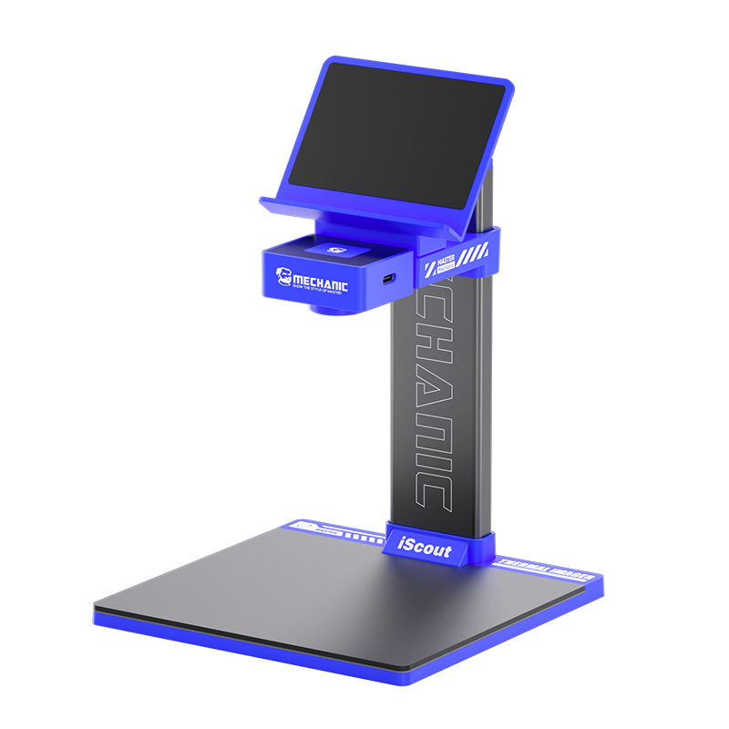

# Mechanic iScout Thermal Camera — Linux Port

<p align="center">
  
</p>

A Linux port of the **Mechanic iScout / DYT** (`com.dyt.wcc`) USB thermal camera.
The vendor ships Android and Windows software only; there is no official Linux
support, so this repository reverse-engineers the device and rebuilds the stack
natively — a C engine, a Qt6 desktop application, a set of command-line tools,
and `.deb` / `.rpm` packages.

The unit is a UVC "dual-vision" module — **256×192** radiometric thermal plus a
visible camera, **8–14 µm**, **−15 °C … 600 °C** — sold under OEM brands
including Mechanic iScout, Mechanic-Ti, Xtherm, Aixun, MaAnt, MileSeey, QianLi,
and others.

> **New here?** Start with the [layman's wiki](docs/wiki/Home.md) — a plain-language
> tour of every option in the app. To build from source, see [`BUILDING.md`](BUILDING.md).

## Status (v0.1.0)

The eight-phase engine roadmap (`RE Docs/08` §8) is **complete**: units and
display, measurement and alarms, device read-back and the one parameter write,
the visible half and fusion, stills and the DYT container, mp4 recording, and the
2× super-resolution zoom.

The **Qt6 desktop application (`dytqt`)** is built and feature-complete against
the vendor's own Windows app (`ThermalAnalysisSystem.exe`): a dark shell with an
icon rail, a live canvas and a tabbed control panel, covering measurement and
alarms, annotations, the 3D surface, board comparison, a circuit-layout overlay,
super-resolution, stills and clips with a gallery, the device panel and runtime
parameters, and a Settings dialog. It also ships as `.deb` and `.rpm` packages.

**Verified, not assumed.** The frame→temperature pipeline is byte-verified
against the vendor's own `libthermometry.so` for all four sensor widths in both
`fix_mode` configurations; live capture and recording work on hardware; and the
super-resolution output matches the vendor's own model to within one LSB.
`make check` is the CI gate and needs no camera attached.

**Not yet established:** absolute temperature accuracy — nothing has been
compared against a calibrated reference, so the atmospheric-transmittance model
is still `[?]` (`RE Docs/09` §9). The visible and thermal planes are 1:1 in grid
terms by construction, and `0,0` is the vendor's own alignment default, but the
**optical boresight** of the two lenses has not been measured (`RE Docs/04`
§4.10). The remaining `[?]` items are listed in `RE Docs/09`.

## What you get

| Piece | What it is |
|---|---|
| `libdyt` | the C engine — thermometry, the frame pipeline, display, measurement, alarms, palettes, JPEG/DYT stills, mp4, and the super-resolution seam |
| `dytqt` | the Qt6 Widgets desktop application |
| `dytview` | the OpenCV live viewer (a second, headless-friendly front end over the same engine) |
| `dytrec`, `probe`, `capture_demo` | the mp4 recorder, the read-only device interrogator, and a capture demo |
| packages | `.deb` and `.rpm`, both staged through `make install` |

Every dependency is **detected, never required**. A host with only a C compiler
builds the engine and passes `make check`; each optional piece (libusb, OpenCV,
Qt6, MNN) simply adds a tool or a feature.

## Quick start

```bash
git clone https://github.com/akbar-npj/Mechanic-Iscout-Thermal-Camera-linux-Port.git
cd Mechanic-Iscout-Thermal-Camera-linux-Port/linux-port
./build.sh                 # build + make check (the default)
./build/dytqt              # run the app (fixture, or the camera if attached)
./build/dytqt --selftest   # headless GUI check, needs no display and no camera
```

`./build.sh` wraps the Makefile and needs no flags. The underlying commands are
`make`, `make check`, `make install`, `make deb` and `make rpm`.

- `make check` runs the unit tests, the `probe --selftest` safety check, the
  packaging cross-checks, and byte-compares the frame pipeline against frozen
  vendor ground truth — no camera needed.
- `cc`, `make` and `ar` are all that is required to build and test. `libusb-1.0`,
  OpenCV, Qt6 and MNN are each optional and detected at build time.
- The JPEG backend is the vendored stb (always present); `make JPEG=libjpeg`
  selects libjpeg as an accelerator. No network access is needed — libuvc and stb
  are vendored and built from source.

**See [`BUILDING.md`](BUILDING.md)** for the per-distribution package lists
(Fedora and Debian/Ubuntu), the install targets, the udev rule that gives the app
access to the camera, and packaging.

## Layout

| Path | What |
|---|---|
| `docs/wiki/` | **The layman's guide** — every option explained in plain language. |
| `RE Docs/` | The reverse-engineering write-up. Tagged **[V]** verified / **[I]** inferred / **[?]** unknown. |
| `linux-port/` | The port: engine, GUI, tests, CLI tools, vendored libuvc. |
| `linux-port/gui/README.md` | The deep engineering notes for the Qt6 front end. |
| `BUILDING.md` | Build, install, camera access and packaging. |
| `RE Workspace/` | Generated analysis material (extracted APK, decompilation, NSIS blocks). Disposable; the scripts that regenerate it are tracked. |
| `iScout … v3.0.6+windows/` | The vendor originals. Not tracked. |

## Documentation map

| | |
|---|---|
| [`docs/wiki/Home.md`](docs/wiki/Home.md) | The layman's wiki — start here if you just want to use the app |
| [`BUILDING.md`](BUILDING.md) | How to build, install, package, and grant camera access |
| [`linux-port/gui/README.md`](linux-port/gui/README.md) | How the Qt6 window is built and why (engineering detail) |
| [`RE Docs/README.md`](RE%20Docs/README.md) | Orientation and the executive summary of findings |
| [`RE Docs/04-usb-protocol.md`](RE%20Docs/04-usb-protocol.md) | The vendor control-transfer protocol and opcode table |
| [`RE Docs/05-thermometry-algorithm.md`](RE%20Docs/05-thermometry-algorithm.md) | The radiometric model |
| [`RE Docs/08-linux-port-plan.md`](RE%20Docs/08-linux-port-plan.md) | The port plan, as built |
| [`RE Docs/09-open-questions-and-next-steps.md`](RE%20Docs/09-open-questions-and-next-steps.md) | What is still unproven |
| [`RE Docs/10-calibration-tables.md`](RE%20Docs/10-calibration-tables.md) | The Windows calibration tables |

The RE docs are tagged **[V]** verified / **[I]** inferred / **[?]** unknown. The
tagging is deliberate and load-bearing: the project has previously contained
fabricated write-ups, so do not treat **[I]** or **[?]** as established fact.

## Safety

**Never send a WRITE-classified opcode to the device.** The write path can
destroy the factory calibration, and that cannot be reconstructed from anything
in this repository — the Windows calibration tables are not confirmed to hold the
same data.

`RE Docs/04-usb-protocol.md` §4.8 classifies every recovered function as
reads-only, stream control, or dangerous-write. `probe` implements only the first
two: it refuses any opcode whose table entry is marked `WRITE`
(`linux-port/tools/probe.c:279`), and `probe --selftest` exercises that guard
without a device attached. The one write the app itself makes is the four runtime
radiometric parameters (emissivity, ambient, reflected, distance), which the
device supports and which are armed and confirmed explicitly — see
[the device page](docs/wiki/The-device.md).

## Not tracked

The vendor installer (294 MB) and APK (169 MB), everything derived from them, all
build output, and the reference material kept beside the repo for cross-checking
(`Thermal-Camera-Redux/`, and `MechaniscoutPcap/` — 1.1 GB of USB captures). This
repository tracks *work only*. See `.gitignore`, which documents each rule.

## License

GPL-3.0 — see `LICENSE`.

The vendored components in `linux-port/third_party/` keep their own terms:
`libuvc` is BSD (`LICENSE.txt`) and `stb` is dual MIT / public domain
(`LICENSE`). MNN is not vendored — the recipe in `linux-port/third_party/README.md`
fetches and builds it — and is Apache-2.0.

The vendor's own binaries, and everything derived from them, are not distributed
here; see `.gitignore`.

The product photograph in `docs/images/` is the manufacturer's own promotional
image of the Mechanic iScout unit, included for identification only; all
trademarks and rights belong to their respective owners.
